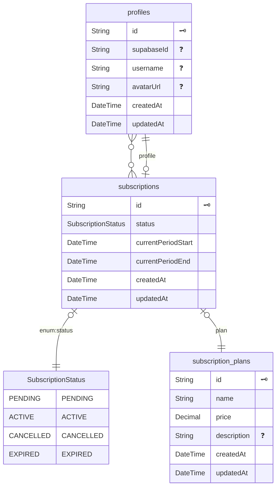

```mermaid
erDiagram

        SubscriptionStatus {
            PENDING PENDING
ACTIVE ACTIVE
CANCELLED CANCELLED
EXPIRED EXPIRED
        }
    
  "profiles" {
    String id "🗝️"
    String supabaseId "❓"
    String username "❓"
    String avatarUrl "❓"
    DateTime createdAt 
    DateTime updatedAt 
    }
  

  "subscriptions" {
    String id "🗝️"
    SubscriptionStatus status 
    DateTime currentPeriodStart 
    DateTime currentPeriodEnd 
    DateTime createdAt 
    DateTime updatedAt 
    }
  

  "subscription_plans" {
    String id "🗝️"
    String name 
    Decimal price 
    String description "❓"
    DateTime createdAt 
    DateTime updatedAt 
    }
  
    "profiles" o{--}o "subscriptions" : ""
    "subscriptions" o|--|| "SubscriptionStatus" : "enum:status"
    "subscriptions" o|--|| "profiles" : "profile"
    "subscriptions" o|--|| "subscription_plans" : "plan"
```
