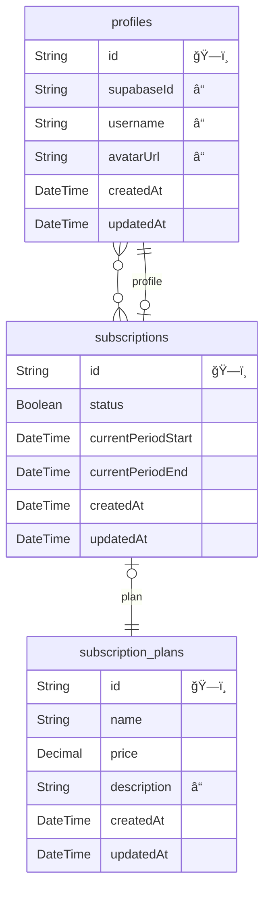

```mermaid
erDiagram

  "profiles" {
    String id "ğŸ—ï¸"
    String supabaseId "â“"
    String username "â“"
    String avatarUrl "â“"
    DateTime createdAt 
    DateTime updatedAt 
    }
  

  "subscriptions" {
    String id "ğŸ—ï¸"
    Boolean status 
    DateTime currentPeriodStart 
    DateTime currentPeriodEnd 
    DateTime createdAt 
    DateTime updatedAt 
    }
  

  "subscription_plans" {
    String id "ğŸ—ï¸"
    String name 
    Decimal price 
    String description "â“"
    DateTime createdAt 
    DateTime updatedAt 
    }
  
    "profiles" o{--}o "subscriptions" : ""
    "subscriptions" o|--|| "profiles" : "profile"
    "subscriptions" o|--|| "subscription_plans" : "plan"
```
